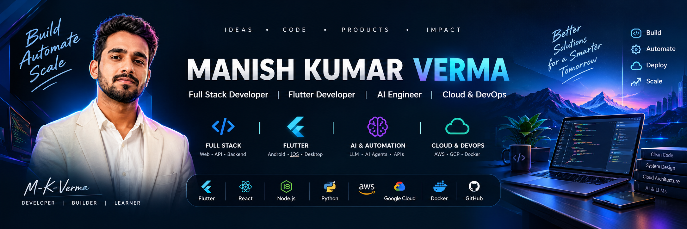

# Manish Kumar Verma

**Full Stack Developer · Flutter Developer · AI Engineer · Cloud & DevOps**

_I design, build, and ship practical software—from a first idea to a reliable product._

---

## Building with product thinking

I am a software developer focused on useful, production-minded products across **web**, **mobile**, **desktop**, and **cloud**. My strongest interests sit where full-stack engineering, Flutter, AI-powered experiences, automation, and dependable delivery meet.

> **Research the problem → shape the product → build cleanly → automate wisely → ship confidently.**

---

## What I bring to a product

| Focus | What that looks like |
| :-- | :-- |
| 🌐 **Full-stack engineering** | Responsive interfaces, REST APIs, authentication, backend services, and data models that stay maintainable. |
| 📱 **Flutter** | Purposeful cross-platform apps for Android, iOS, Windows, and Linux with a consistent product experience. |
| 🤖 **AI & automation** | LLM features, AI agents, tool calling, workflow automation, and smart API integrations. |
| ☁️ **Cloud & DevOps** | Container-ready delivery, CI/CD, environment discipline, monitoring, and scalable architecture. |

---

## Technology toolkit

`Dart` · `JavaScript` · `TypeScript` · `Python` · `Java` · `HTML` · `CSS`

`Flutter` · `React` · `Next.js` · `Tailwind CSS`

`Node.js` · `Express` · `FastAPI` · `REST APIs` · `Authentication`

`PostgreSQL` · `MySQL` · `MongoDB` · `Firebase` · `Supabase`

`LLM applications` · `AI agents` · `RAG` · `Tool calling` · `Automation`

`Docker` · `GitHub Actions` · `Linux` · `AWS` · `GCP` · `Vercel`

---

## Featured work

### 🎓 Shaurya — AI-powered learning and assessment platform

Shaurya is an education-platform concept for structured assessments, AI-supported learning, and meaningful performance insights for students and educators.

**Designed around:** online test series · AI question generation · doubt-solving support · notes and learning content · student analytics · rankings · teacher tools · administration workflows

**Product direction:** Flutter · Dart · Firebase / Supabase · cloud services · AI APIs · web, mobile, and desktop access

**Repository:** `ADD_SHAURYA_REPOSITORY_URL`

### 🧠 AI Agent Platform

An ongoing exploration of intelligent agents that combine language models with tools, APIs, context, and multi-step workflows.

**Exploring:** LLM integrations · tool calling · agent architecture · context management · workflow automation · external-service connections

**Repository:** `ADD_AI_AGENT_REPOSITORY_URL`

### 🏗️ Real Estate & Construction Platform

A centralised property workflow for managing property information and preparing it for maps, marketing, and digital distribution.

**Focus:** property data · images and plans · geolocation · map integrations · publishing workflows · marketing support

**Repository:** `ADD_REAL_ESTATE_REPOSITORY_URL`

---

## Now

- Building AI-powered product features and reliable automation workflows
- Expanding Flutter experiences across mobile and desktop
- Developing scalable backend systems and cloud delivery practices
- Exploring practical AI for education and business applications

---

## Engineering values

`Clarity over complexity` · `Security by design` · `Performance that users feel` · `Automation where it helps` · `Architecture that can grow` · `Real-world usability first`

---

## Let’s build something useful

I am open to thoughtful collaboration in **Full Stack**, **Flutter**, **AI/LLM applications**, **automation**, **Cloud/DevOps**, **EdTech**, and **open source**.

| Contact | Add your real detail before publishing |
| :-- | :-- |
| Portfolio | `ADD_PORTFOLIO_URL` |
| LinkedIn | `ADD_LINKEDIN_URL` |
| Email | `ADD_EMAIL_ADDRESS` |

---

_Build with intent. Automate with care. Ship software that matters._

